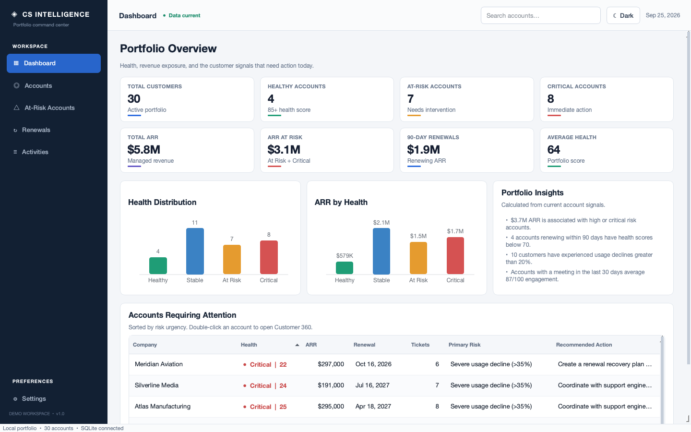
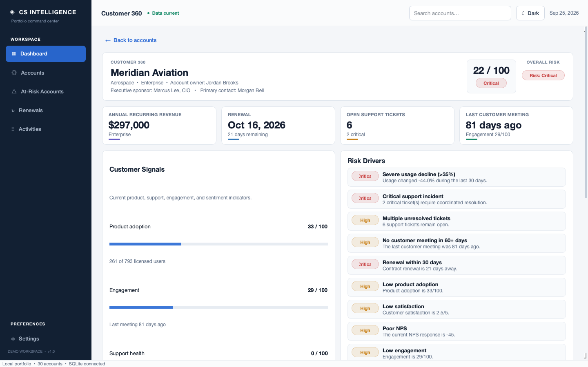
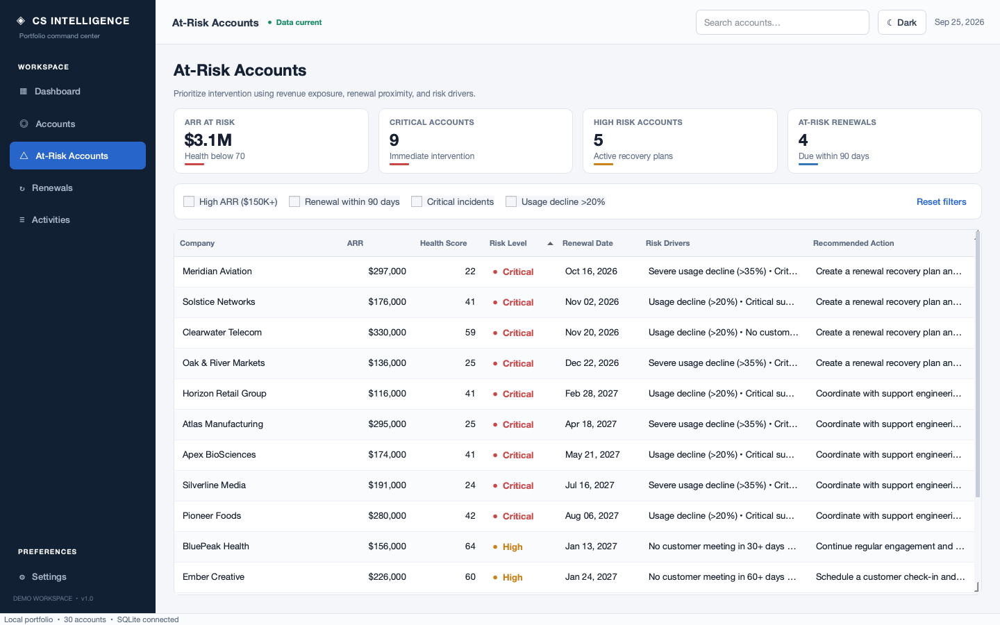
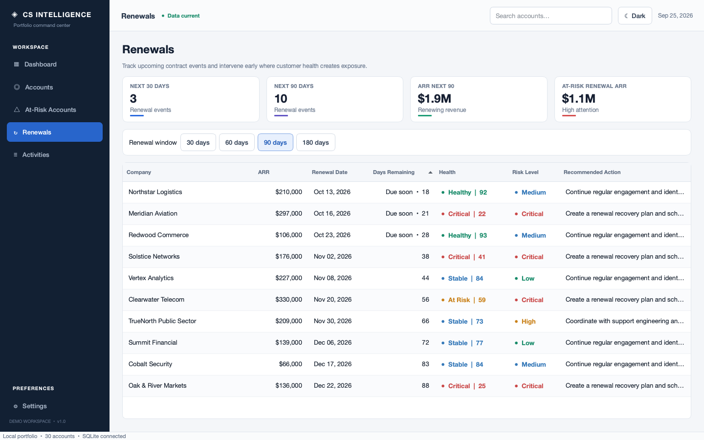

# Customer Success Intelligence Dashboard

A PySide6 desktop application that models how Customer Success and Technical Account Management teams can monitor a SaaS customer portfolio. It combines product adoption, support, engagement, sentiment, renewal, and revenue data into explainable health scores, risk assessments, and recommended next actions. All customer data is fictional and generated for demonstration.

## Overview

Customer-facing teams often review product usage, support incidents, customer sentiment, meeting history, and contract dates in separate systems. That fragmentation makes it harder to decide which accounts need attention and why.

This application consolidates those signals into a local decision-support workspace with a portfolio dashboard, searchable account list, Customer 360 profiles, renewal planning, and persistent account history.

## Key Features

- Database-driven portfolio KPIs and health visualizations
- Searchable and filterable customer portfolio
- Customer 360 profiles with adoption, support, engagement, and sentiment signals
- Weighted account health scoring with documented inputs
- Multi-signal risk detection independent of the health category
- Rule-based recommended actions tied to detected conditions
- ARR-at-risk and renewal-window analysis
- At-risk account intervention queue
- Persistent account notes and activity timeline
- Light and dark themes
- First-run generation of 30 correlated fictional customer accounts

## Screenshots

### Portfolio Dashboard



### Customer 360



### At-Risk Accounts



### Renewal Pipeline



## Technology Stack

- Python 3.12+
- PySide6 / Qt 6
- SQLite through Python's `sqlite3` module
- pytest

Charts are rendered with Qt painting so they remain lightweight, resize with the desktop interface, and follow the active theme. The project does not use SQLAlchemy, pandas, matplotlib, a web framework, or an external service.

## Architecture

```text
PySide6 pages and reusable widgets
                │
                ▼
Health, risk, renewal, recommendation, and analytics services
                │
                ▼
SQLite query layer and Customer domain model
                │
                ▼
Locally generated SQLite database
```

- `app/ui/` owns presentation, navigation, themes, dialogs, and user interaction.
- `app/services/` contains deterministic business rules and portfolio calculations without Qt dependencies.
- `app/database/` owns schema creation, queries, persistence, and fictional seed data.
- `app/utils/` contains shared display formatting.
- `tests/` exercises business thresholds, analytics, first-run seeding, persistence, and primary UI workflows.

The structure intentionally stays small. A repository layer or ORM would add little value for a local database with three tables and a narrow query surface.

## Health Scoring

Account health is calculated on a 0–100 scale:

| Component | Weight |
|---|---:|
| Product adoption | 30% |
| Customer engagement | 20% |
| Support health | 20% |
| Customer satisfaction | 15% |
| 30-day usage trend | 15% |

Support health accounts for open tickets, critical incidents, and average resolution time. Customer satisfaction combines normalized CSAT, NPS, and sentiment. Usage trend is normalized and clamped so one extreme input cannot push the overall score outside 0–100.

| Category | Score |
|---|---:|
| Healthy | 85–100 |
| Stable | 70–84 |
| At Risk | 50–69 |
| Critical | 0–49 |

Weights and thresholds are named constants in `app/services/health_service.py`.

## Risk Detection and Recommendations

Risk is not derived solely from health. The rule set also considers declining usage, critical and unresolved support tickets, meeting gaps, renewal proximity, low adoption, low engagement, customer satisfaction, NPS, and high ARR exposure. Weighted signals produce a Low, Medium, High, or Critical classification.

Recommendations are deterministic rules, not machine learning. Renewal recovery, incident coordination, adoption reviews, enablement, customer check-ins, and feedback follow-up are selected from the account's current conditions and ordered by urgency.

## Database and Demo Data

The application creates `data/customer_success.db` automatically on first launch. An empty database is seeded once with 30 fictional accounts and four activities per account. Later launches preserve user-added notes and activities while refreshing derived health and risk fields; renewal-related risk can change as contract dates approach.

The generated database is ignored by Git because a clean clone can recreate it. All company names, people, activities, revenue figures, and operational metrics are fictional. The seed uses correlated account profiles so adoption, support, satisfaction, and risk tell coherent customer stories.

## Installation

Python 3.12 or newer is required. After cloning or downloading the repository, run these commands from the project root.

### macOS and Linux

```bash
python3 -m venv .venv
source .venv/bin/activate
python -m pip install --upgrade pip
python -m pip install -r requirements.txt
python main.py
```

### Windows PowerShell

```powershell
py -3.12 -m venv .venv
.venv\Scripts\Activate.ps1
python -m pip install --upgrade pip
python -m pip install -r requirements.txt
python main.py
```

To reset only the demo database, close the application, delete `data/customer_success.db`, and launch again.

## Running Tests

```bash
python -m pytest
```

Tests use isolated temporary databases and do not depend on the developer's local demo database.

## Example Use Case

A Technical Account Manager opens the dashboard and sees that a high-ARR customer has declining product usage, a critical support incident, and a renewal within 90 days. They open Customer 360 to review the evidence, follow the recommended recovery actions, record a customer meeting, and add context for the next account-team handoff.

## Project Purpose

This project demonstrates the intersection of Customer Success, Technical Account Management, business analytics, Python desktop development, relational data design, decision support, and user experience. It is a portfolio simulation rather than a production system or a claim of real customer outcomes.

### Portfolio Description

Built a Python and PySide6 customer-success dashboard that consolidates fictional SaaS adoption, support, engagement, sentiment, revenue, and renewal data into portfolio analytics and Customer 360 profiles. SQLite provides local persistence, while deterministic health, risk, renewal, and recommendation services turn account signals into explainable priorities and next actions. Automated tests cover business rules, analytics, first-run seeding, persistence, and core UI workflows.

## Future Improvements

- Read-only connectors for CRM, support, and product-telemetry systems
- Role-based access and a shared service-backed database
- Configurable score weights with an audit trail
- Historical time-series data and health trend analysis
- Evaluated predictive churn models alongside the transparent rules baseline

## License

This project is available under the [MIT License](LICENSE).
